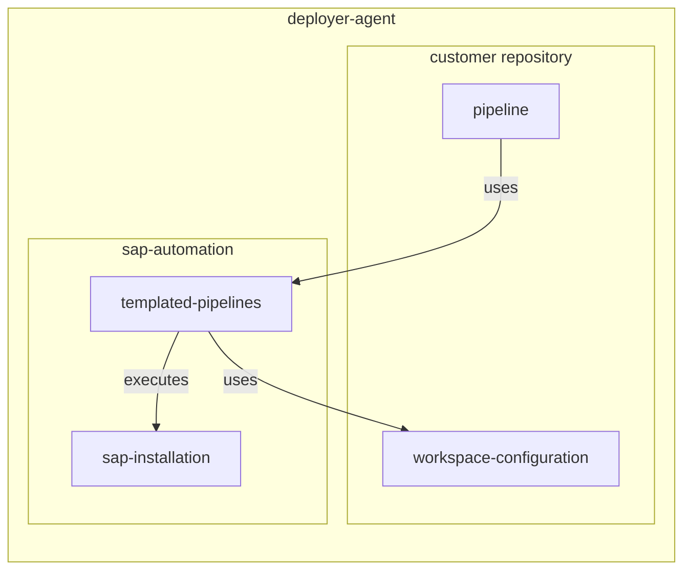

# Boilerplate

The sap-automation repository is a framework that offers you automation to deploy a SAP certified installation. To use the sap-automation framework you need to create a repository of your own and reference the sap-automation repository. This way you keep your organisation specific configuration and the sap-automation framework separate. Having the configuration separate prevents you from making uninted changes to the sap-automation framework and gives you the possibility to add your own processes and configuration on top of the sap-automation framework by including additional pipelines.

## Getting started

To get started with your own configuration repository we added this boilerplate with the most basic configuration for the pipelines already configured. Just copy the content of the boilerplate folder into the root of your configuration repository and change the following configuration.

In the resouces.yml configure the following configuration by replacing ```<MyGithubConnector>``` with the name of your Github connector.

``` yaml
    - repository: sap-automation
      type: github
      name: Azure/sap-automation
      endpoint: <MyGithubConnector>
      ref: refs/heads/main
```

The procedure to create a service connection is described [here](https://learn.microsoft.com/en-us/azure/devops/boards/github/connect-to-github?view=azure-devops#add-a-github-connection-using-pat)

## How it works

During pipeline execustion the two repositories will be present on the deployer-agent. Each of the repositories will be mapped using the following:

- sap-automation will be mapped to ```/sap-automation```
- customer configuration repository will be mapped to ```/config```

During execution the repositories will interact with eachother by using the following:



## Custom Nightly

To validate the remote repository every night on your own environment there is a nightly.yml inside custom. You can change this to your own needs. The configuration of variables is just an example. Look for the MGMTNIGHTLY and the NIGHT configuration inside the WORKSAPCES for the configuration you want to deploy there. The deployment will be removed after success.

Create the following libraries to support the nightly build:

- MGMTNIGHTLY
- NIGHT
