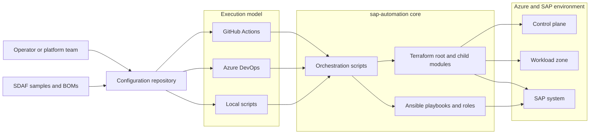
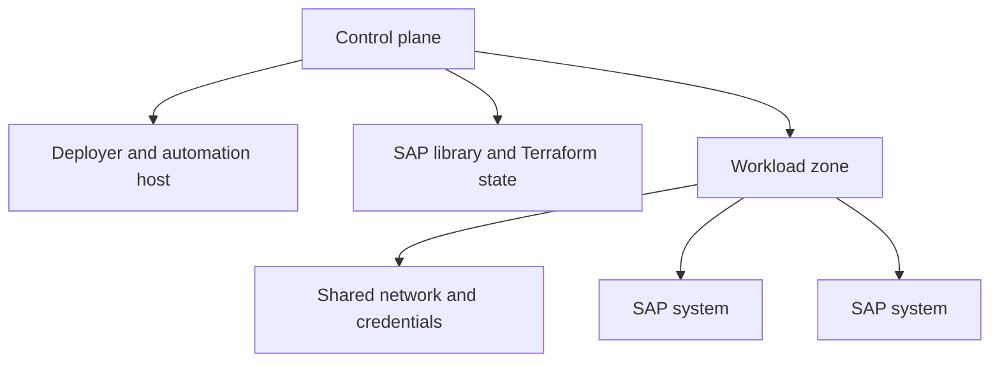

# SAP Deployment Automation Framework architecture

SAP Deployment Automation Framework (SDAF) separates deployment orchestration,
infrastructure provisioning, operating-system and SAP configuration, and
organization-owned configuration. This separation lets GitHub Actions, Azure
DevOps, and local execution use the same core Terraform and Ansible
implementation.

Use this article to understand the framework boundaries before you select an
[execution model](deployment-options.md), design a deployment, or extend SDAF.

## Architecture at a glance

SDAF spans four repositories:

- [`Azure/sap-automation`](https://github.com/Azure/sap-automation) contains
  the core Terraform, Ansible, scripts, shared pipeline templates, setup
  utilities, and configuration Web application.
- [`Azure/sap-automation-gh-bootstrap`](https://github.com/Azure/sap-automation-gh-bootstrap)
  owns the GitHub configuration-repository template and workflows.
- [`Azure/sap-automation-bootstrap`](https://github.com/Azure/sap-automation-bootstrap)
  owns the Azure DevOps configuration-repository template and wrapper
  pipelines.
- [`Azure/SAP-automation-samples`](https://github.com/Azure/SAP-automation-samples)
  owns reusable Terraform examples, SAP application definitions, bill of
  materials (BOM) files, and Ansible samples.

The execution models provide different repository, identity, approval, and
runner boundaries. They don't provide separate infrastructure
implementations. For an ownership-level view, see
[SDAF repositories](repositories.md).

## Deployment hierarchy

SDAF organizes Azure resources into three deployment layers.

### Control plane

The control plane supplies regional deployment services:

- A deployer that runs Terraform and acts as the Ansible controller.
- Persistent storage for Terraform state.
- Persistent storage for SAP installation media.
- Key vaults for deployment credentials.
- Optional shared DNS and configuration services.

The control-plane Terraform roots are
[`run/sap_deployer`](../deploy/terraform/run/sap_deployer/) and
[`run/sap_library`](../deploy/terraform/run/sap_library/). Bootstrap variants
under [`bootstrap`](../deploy/terraform/bootstrap/) support initial deployment
before remote state is available.

### Workload zone

A workload zone supplies shared resources for one or more SAP systems. It
typically represents a network and operational boundary such as development,
quality assurance, or production.

The [`run/sap_landscape`](../deploy/terraform/run/sap_landscape/) root module
reads control-plane outputs and deploys or connects to resources such as
virtual networks, subnets, key vaults, shared storage, and DNS configuration.

### SAP system

An SAP system is the deployment unit for one SAP system identifier (SID). It
contains the virtual machines, storage, load balancers, availability
constructs, and other resources required by the database and application
tiers.

The [`run/sap_system`](../deploy/terraform/run/sap_system/) root module reads
workload-zone state and composes common infrastructure, database, application,
and output-file modules. The output-file module generates the inventory and
`sap-parameters.yaml` input consumed by Ansible.

## Configuration, state, and execution flow

SDAF keeps deployment intent, generated artifacts, and deployment state
separate.

1. The configuration repository supplies Terraform parameter files,
   optional Ansible extensions, and release-specific deployment settings.
2. Samples can provide a starting point, but the deployment team reviews and owns the
   resulting configuration.
3. The selected execution model invokes the core scripts and pipeline
   templates.
4. Terraform deploys each layer and persists its state in the SAP library
   storage account.
5. Later layers read selected outputs from earlier remote state. A workload
   zone consumes control-plane outputs, and an SAP system consumes
   workload-zone outputs.
6. The SAP-system output module generates Ansible inventory and parameter
   files.
7. Ansible configures the operating system, database, high availability, and
   SAP application and processes the selected BOM.

> [!IMPORTANT]
> Terraform state is an operational dependency, not a generated sample.
> Protect it with the same access, retention, backup, and change-control
> requirements as the deployed environment.

## Identity and trust boundaries

Identity crosses several scopes:

- The execution platform authenticates to Azure.
- The control-plane deployment identity creates or connects to regional
  deployment resources.
- Each workload zone can use a dedicated deployment identity.
- Key vaults store deployment and system credentials.
- Terraform state access is authorized through the SAP library storage
  account.
- The deployer connects to managed nodes for Ansible configuration.

GitHub environments and federated credentials, Azure DevOps service
connections and variable groups, and locally selected Azure CLI or managed
identities implement these boundaries differently. Review the selected
[deployment option](deployment-options.md) before assigning access.

## Infrastructure and configuration boundaries

Terraform owns Azure resource lifecycle. Ansible owns guest operating-system,
database, cluster, and SAP configuration. Avoid managing the same setting in
both layers.

| Layer | Primary responsibility | Source |
| --- | --- | --- |
| Execution | Repository checkout, identity, approvals, parameters, and invocation | GitHub workflow, Azure pipeline, or local operator |
| Orchestration | Stage ordering, initialization, plan and apply operations, output handling, and removal | [`deploy/scripts`](../deploy/scripts/) and [`deploy/pipelines`](../deploy/pipelines/) |
| Infrastructure | Azure resources, dependencies, and Terraform outputs | [`deploy/terraform`](../deploy/terraform/) |
| Configuration | OS, database, HA, SAP software, and application configuration | [`deploy/ansible`](../deploy/ansible/) |
| Deployment inputs | Environment parameters, optional extensions, SAP definitions, and BOM selection | Configuration and samples repositories |

## Availability and deployment patterns

SDAF can deploy standalone, distributed, and distributed highly available SAP
architectures. It can create new resources or consume supported existing
resources when the relevant configuration accepts their Azure resource IDs.

Architecture support depends on the selected operating system, database,
storage, SAP topology, Azure region, and available VM SKUs. Review the
[SDAF supportability matrix](supportability.md) and current SAP on Azure
certification guidance before finalizing the design.

See [Extend SDAF](extensibility.md) for extension points, execution behavior,
and maintenance boundaries.
