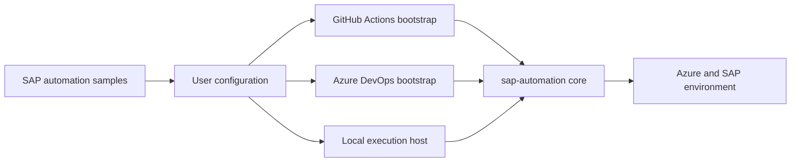

# SDAF repositories

SAP Deployment Automation Framework (SDAF) separates the framework source,
execution-platform bootstrap assets, and reusable samples into four
repositories. Keep detailed procedures with the repository that owns the
executable asset.

## Repository responsibilities

| Repository | Responsibility | Primary assets |
| --- | --- | --- |
| [`Azure/sap-automation`](https://github.com/Azure/sap-automation) | Central documentation, framework source, local execution, and shared pipeline templates | Terraform, Ansible, scripts, GitHub and Azure DevOps setup utilities, runner infrastructure, pipeline templates, and Web application |
| [`Azure/sap-automation-gh-bootstrap`](https://github.com/Azure/sap-automation-gh-bootstrap) | GitHub configuration-repository bootstrap and GitHub Actions execution | Configuration-repository template and workflows |
| [`Azure/sap-automation-bootstrap`](https://github.com/Azure/sap-automation-bootstrap) | Azure DevOps configuration-repository bootstrap and Azure Pipelines execution | Configuration-repository structure and wrapper pipelines |
| [`Azure/SAP-automation-samples`](https://github.com/Azure/SAP-automation-samples) | Shared deployment examples and SAP software definitions | Terraform examples, SAP definitions, BOM files, and Ansible samples |

## Understand the dependency flow

The GitHub Actions, Azure DevOps, and local paths call the core Terraform,
Ansible, and script implementation. The samples repository supplies inputs
that users review and adapt before execution.

See [SDAF architecture](architecture.md) for the deployment layers, remote-state
dependencies, configuration flow, and identity boundaries behind this
repository relationship.

## Locate a change

Use the following steps when you report a problem or propose a change:

1. Identify the executable asset that implements the behavior.
2. Open an issue or pull request in the repository that owns that asset.
3. Include cross-repository links when a change affects an execution wrapper
   and the core implementation.
4. Update central comparison content only when the capability or ownership
   boundary changes.
5. Update the detailed platform procedure in the same change as its workflow,
   pipeline, script, or sample.

After these steps, the change is tracked with the source that can validate and
maintain it.

| Change | Owning repository |
| --- | --- |
| Terraform module, Ansible role, local script, pipeline template, or Web application | `Azure/sap-automation` |
| GitHub setup utility, repository or environment secret and variable provisioning, or runner implementation | `Azure/sap-automation` |
| GitHub configuration-repository template or workflow | `Azure/sap-automation-gh-bootstrap` |
| Azure DevOps project or workload-zone setup utility, repository resource, variable group, service connection, or agent-pool setup | `Azure/sap-automation` |
| Azure DevOps configuration-repository template or wrapper pipeline | `Azure/sap-automation-bootstrap` |
| Terraform example, SAP definition, BOM file, or Ansible sample | `Azure/SAP-automation-samples` |

Use [Extend SDAF](extensibility.md) before selecting a change location.
Configuration inputs and Ansible hooks normally belong in the
configuration repository. Changes to Terraform modules, core Ansible roles, or
orchestration scripts belong in `Azure/sap-automation` or an organization-maintained
fork.

## Keep links stable

- Link from the central hub to stable repository entry points.
- Use relative links for content in the same repository.
- Link directly to an owning repository when a procedure depends on its
  current workflow, pipeline, script, or sample.
- Do not duplicate a complete platform procedure in the central repository.
- Preserve existing paths where practical. If content moves, retain a short
  compatibility page at the old path.
